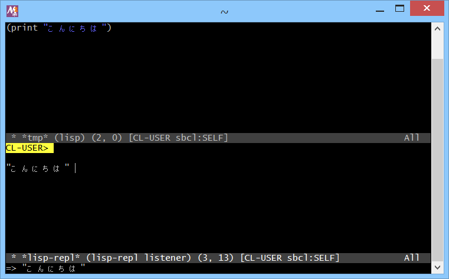

# lem-mg-patch



## 概要
- Lem エディタを MSYS2/MinGW-w64 環境で動かすためのパッチです。  
  現状、いろいろと問題点があります(実験中)。

- オリジナルの情報は以下にあります。  
  https://github.com/cxxxr/lem


## 変更点
- オリジナルからの変更点を、以下に示します。

1. cl-charms のパッチ対応
   - PDCurses 用の定義をいくつか追加

2. term.lisp のパッチ対応
   - デフォルトカラーコード(-1)を有効化  
     (カラー情報が正常に扱えるようになった)

3. ncurses.lisp のパッチ対応
   - 日本語を入力してからカーソルを移動すると、表示がずれる件の対策
   - CtrlキーとAltキーが機能しないケースの対策
   - 画面サイズの変更に表示が追従しない件の対策
   - C-x C-c ですぐに終了しない件の対策

4. lisp-mode.lisp のパッチ対応
   - lisp-mode に入ると lem を終了できなくなる件の対策  
     (slime を終了する処理を追加(数秒かかる))

5. buffer.lisp のパッチ対応  
   - セーブのエンコーディングのデフォルトを UTF-8 にした


## インストール方法
- MSYS2/MinGW-w64 (64bit/32bit) 環境でのインストール手順を、以下に示します。

1. MSYS2/MinGW-w64 (64bit/32bit) のインストール  
   事前に MSYS2/MinGW-w64 (64bit/32bit) がインストールされている必要があります。  
   以下のページを参考に、開発環境のインストールを実施ください。  
   https://gist.github.com/Hamayama/eb4b4824ada3ac71beee0c9bb5fa546d  
   (すでにインストール済みであれば本手順は不要です)

2. PDCurses のインストール  
   ＜MSYS2/MinGW-w64 (64bit) 環境の場合＞  
   プログラムメニューから MSYS2 の MinGW 64bit Shell を起動して、以下のコマンドを実行してください。
   ```
   pacman -S mingw64/mingw-w64-x86_64-pdcurses
   cp -i /mingw64/include/pdcurses.h /mingw64/include/ncurses.h
   ```
   ＜MSYS2/MinGW-w64 (32bit) 環境の場合＞  
   プログラムメニューから MSYS2 の MinGW 32bit Shell を起動して、以下のコマンドを実行してください。
   ```
   pacman -S mingw32/mingw-w64-i686-pdcurses
   cp -i /mingw32/include/pdcurses.h /mingw32/include/ncurses.h
   ```
   (すでにインストール済みであれば本手順は不要です)

3. Roswell のダウンロード  
   https://github.com/roswell/roswell/wiki/Installation#windows  
   から、  
   64bit 環境の場合は Roswell-x86_64.zip を、  
   32bit 環境の場合は Roswell-i686.zip を、  
   ダウンロードして、適当なフォルダに展開してください。  
   そして、Windows の環境変数 PATH に、展開したフォルダへのパスを追加してください。  
   (すでにインストール済みであれば本手順は不要です)

4. Roswell のセットアップ  
   ＜MSYS2/MinGW-w64 (64bit) 環境の場合＞  
   プログラムメニューから MSYS2 の MinGW 64bit Shell を起動して、以下のコマンドを実行してください。  
   ＜MSYS2/MinGW-w64 (32bit) 環境の場合＞  
   プログラムメニューから MSYS2 の MinGW 32bit Shell を起動して、以下のコマンドを実行してください。
   ```
   ros setup
   ```
   (すでにインストール済みであれば本手順は不要です)

5. Lem エディタのインストール  
   ＜MSYS2/MinGW-w64 (64bit) 環境の場合＞  
   プログラムメニューから MSYS2 の MinGW 64bit Shell を起動して、以下のコマンドを実行してください。  
   ＜MSYS2/MinGW-w64 (32bit) 環境の場合＞  
   プログラムメニューから MSYS2 の MinGW 32bit Shell を起動して、以下のコマンドを実行してください。
   ```
   ros install cxxxr/lem
   ```

6. パッチデータのダウンロードとコピー  
   本サイト ( https://github.com/Hamayama/lem-mg-patch ) のデータ一式を、  
   (Download Zip ボタン等で) ダウンロードして、適当なフォルダに展開してください。  
   そして、展開したフォルダ内の 1000_copy_patch.bat を実行して、  
   パッチデータをコピーしてください。

7. パッチデータの適用  
   ＜MSYS2/MinGW-w64 (64bit) 環境の場合＞  
   プログラムメニューから MSYS2 の MinGW 64bit Shell を起動して、以下のコマンドを実行してください。  
   ＜MSYS2/MinGW-w64 (32bit) 環境の場合＞  
   プログラムメニューから MSYS2 の MinGW 32bit Shell を起動して、以下のコマンドを実行してください。  
   ```
   cd $USERPROFILE/.roswell/lisp/quicklisp/local-projects/cxxxr/lem
   ./1001_lem_modify.sh
   ```

- 以上です。


## 使い方
- ＜MSYS2/MinGW-w64 (64bit) 環境の場合＞  
  プログラムメニューから MSYS2 の MinGW 64bit Shell を起動して、以下のコマンドを実行してください。  
  ＜MSYS2/MinGW-w64 (32bit) 環境の場合＞  
  プログラムメニューから MSYS2 の MinGW 32bit Shell を起動して、以下のコマンドを実行してください。
  ```
  winpty ros -Q -m lem-ncurses -L sbcl-bin -- $USERPROFILE/.roswell/lisp/quicklisp/bin/lem-ncurses
  ```
  Lem エディタの画面が表示されます。  
  おおむね Emacs のように操作できます。

- M-x lisp-mode で lisp-mode に入ることができます。  
  S式 を入力してから、C-c C-e により末尾の S式 を評価できます。  
  また、先頭で C-space でマークして、末尾にカーソルを移動してから C-c C-r とすると、  
  指定した範囲(リージョン)の S式 を評価できます。


## 問題点
1. コマンドプロンプト上では動作しない
2. mintty 上でも winpty をかませないと動作しない(リダイレクトエラー)
3. マウスが使えない(スクロール等ができない。。。)
4. 日本語を入力してからカーソルを移動すると表示が変になる  
   → 表示位置を調整して対策
5. メタキーが見つからない  
   → ESCキーを押した瞬間に x を押せば M-x になるもよう。。。  
   → AltキーとESCキーがメタキーになるように対策
6. C-space で mark-set にならず @ が表示される  
   → C-space で mark-set になるように対策
7. C-x C-c ですぐに終了しない。その後、何かキーを押すと終了する  
   → イベント処理のループに sleep を入れて対策  
   → また、editor-thread の終了を join で待つように対策
8. mintty の画面サイズを変えても表示が追従しない  
   → 画面サイズの変更に表示が追従するように対策
9. C-x C-w で新しくセーブすると文字コードが SJIS になる  
   → セーブのエンコーディングのデフォルトを UTF-8 にした
10. `M-<` および `M->` による先頭/末尾への移動ができない  
    → PDCurses がイベントを上げてこない  
    → C-Home と C-End に `M-<` と `M->` を割り当てた。。。
11. C-x 3 で画面を縦分割すると、日本語表示の分だけ右画面がずれる  
    → ゼロ幅文字を使って調整
12. 補完メニューの表示が日本語のところでずれる  
    → PDCurses の stdscr のみを使用することで対策
13. 画面分割後にリサイズすると表示が変になることがある  
    → ドット記号で画面を埋めつくすことで対策(スペースでは再描画しなかった)
14. lisp-mode に入ると lem を終了できなくなる  
    → slime を終了する処理を追加(数秒かかる)  
    → 終了に失敗することがある(mintty を落とせば sbcl.exe も終了する。。。)
15. サロゲートペアの文字 (#\U20B9F の「しかる」、#\U1F363 の「すし」(絵文字) 等) の表示に問題がある  
    (カーソルがずれる。カーソルを移動すると表示が乱れる。縦画面分割や補完メニューの表示がずれる等)
16. サロゲートペアの文字 (#\U20B9F の「しかる」、#\U1F363 の「すし」(絵文字) 等) を保存すると、  
    MUTF-8 (Modified UTF-8) で保存される


## その他 情報等
1. Electron版も試してみたが、以下のエラーで動作せず  
   「Uncaught Error: A dynamic link library (DLL) initialization routine failed.」
2. MSYS2 の MSYS用 の ncurses も試してみたが、以下のエラーで動作せず  
   「Unhandled CFFI:LOAD-FOREIGN-LIBRARY-ERROR」
3. バージョンアップについて、  
   `ros update lem`   
   では更新できない(git用?)。  
   `ros install cxxxr/lem`  
   で rename-file に失敗するので、元のフォルダを削除またはリネームしてから、再度  
   `ros install cxxxr/lem`  
   を実行する。  
   そして再度パッチを適用


## 環境等
- OS
  - Windows 8.1 (64bit)
- 環境
  - MSYS2/MinGW-w64 (64bit/32bit) (gcc version 7.3.0 (Rev2, Built by MSYS2 project))
  - PDCurses 3.6-2
  - Roswell 18.8.10.93
- パッチ対象
  - Lem 1.4


## 履歴
- 2018-9-4   v1.4-mg0001 MSYS2/MinGW-w64 対応
- 2018-9-5   v1.4-mg0002 画面サイズの変更に表示が追従するように対策
- 2018-9-5   v1.4-mg0003 画面更新の不具合対策  
  キー入力の不具合対策(C-Home と C-End に `M-<` と `M->` を割り当て)
- 2018-9-7   v1.4-mg0004 lisp-mode に入ると lem を終了できなくなる件の対策
- 2018-9-7   v1.4-mg0005 行の折り返し表示の修正。Escキー処理の見直し
- 2018-9-7   v1.4-mg0006 セーブのエンコーディングのデフォルトを UTF-8 にした
- 2018-9-7   v1.4-mg0007 C-x C-c ですぐに終了しない件の対策
- 2018-9-9   v1.4-mg0008 C-x 3 で画面を縦分割すると、日本語表示の分だけ右画面がずれる件の対策
- 2018-9-10  v1.4-mg0009 PDCurses の stdscr のみを使用するように変更
- 2018-9-10  v1.4-mg0010 sleep の位置を調整
- 2018-9-11  v1.4-mg0011 デフォルトカラーコード(-1)を有効化  
  (カラー情報が正常に扱えるようになった)


(2018-9-11)
